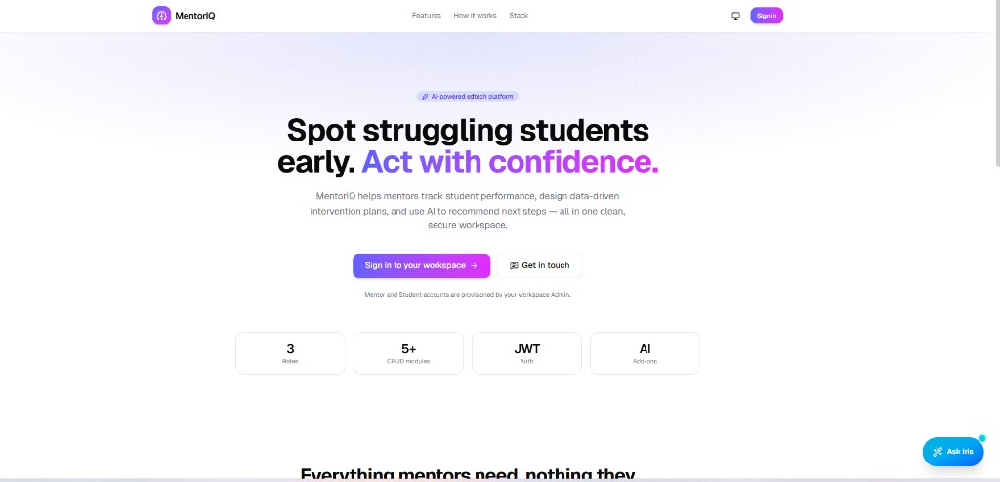
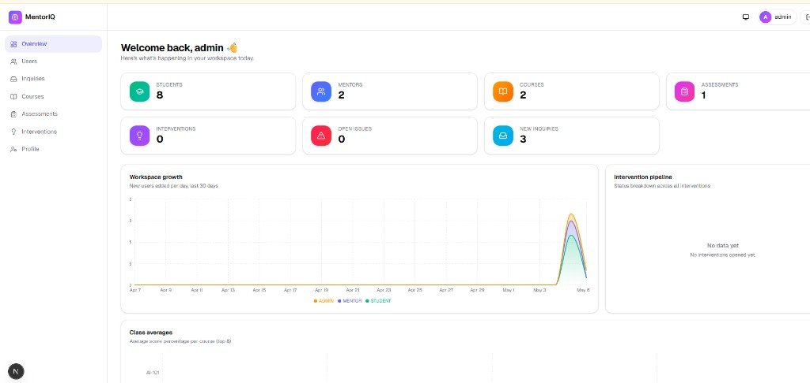
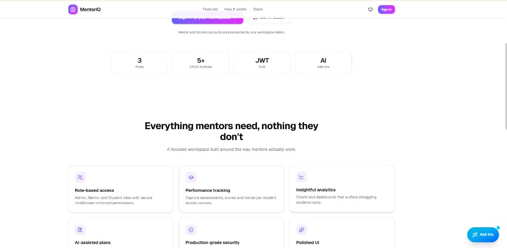
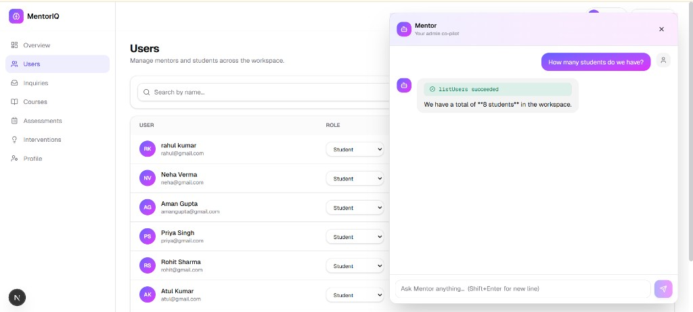
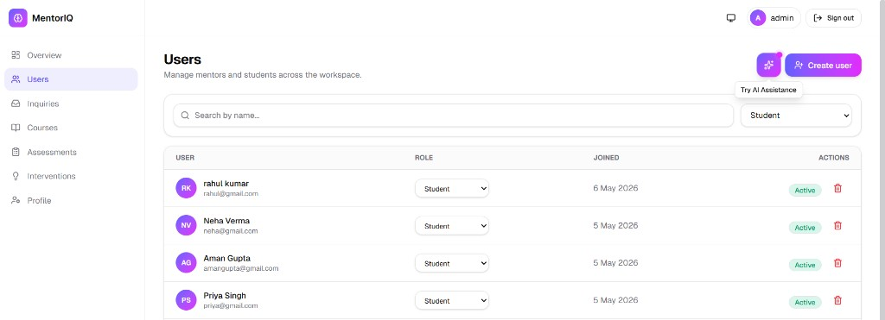
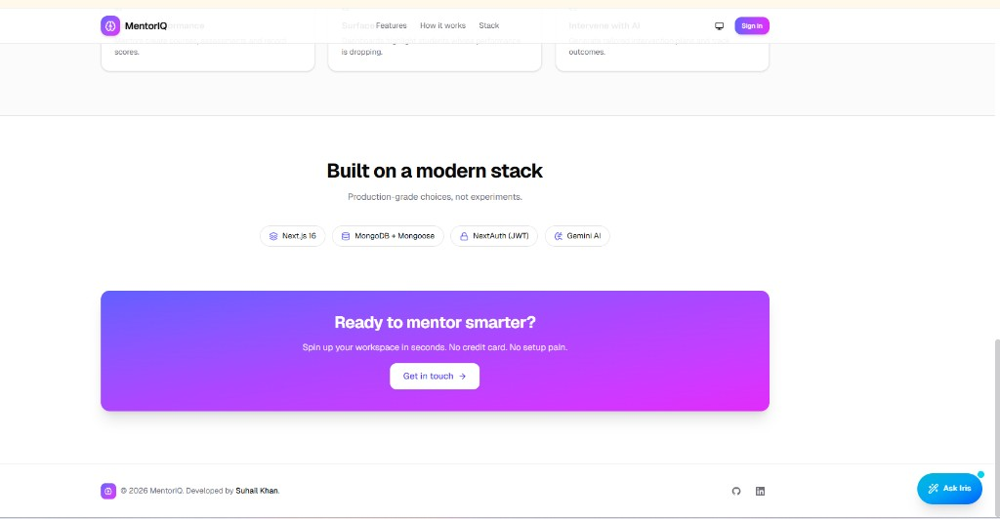

<div align="center">

# MentorIQ

### AI-Assisted Student Performance & Intervention Platform

A focused workspace that helps mentors spot struggling students early
and act with confidence — powered by two purpose-built AI assistants.

[](https://nextjs.org)
[](https://www.typescriptlang.org)
[](https://www.mongodb.com/atlas)
[](https://tailwindcss.com)
[](https://platform.openai.com)

</div>

---

## Table of Contents

1. [Why MentorIQ](#why-mentoriq)
2. [Live demo & screenshots](#live-demo--screenshots)
3. [Feature highlights](#feature-highlights)
4. [The two AI assistants](#the-two-ai-assistants)
5. [Tech stack](#tech-stack)
6. [Architecture](#architecture)
7. [Project structure](#project-structure)
8. [Getting started locally](#getting-started-locally)
9. [Environment variables](#environment-variables)
10. [Deploying to Vercel](#deploying-to-vercel)
11. [Security model](#security-model)
12. [Roles & access control](#roles--access-control)
13. [Roadmap](#roadmap)
14. [Author](#author)

---

## Why MentorIQ

Most school dashboards are heavy CMSes designed for administrators.
MentorIQ is built for the **mentor in the room** — the person who needs
to know *which student is slipping*, *why*, and *what to do next* in
under 30 seconds.

It does this by combining four ideas:

1. **Tight CRUD around the things mentors actually use** — courses,
   assessments, students and intervention plans.
2. **Role-based access** so admins, mentors, and students each see only
   what's useful to them.
3. **An admin AI co-pilot** ("Mentor") that creates, updates and
   removes users via natural language — no clicking through forms.
4. **A public AI helper** ("Iris") on the landing page that answers
   visitor questions and submits contact-us inquiries directly into
   the admin queue.

---

## Live demo & screenshots


🔗 **Live:** https://hoet-mentoriq-suhail.vercel.app/

Preview images live in [`docs/readme/`](docs/readme/).

| Landing (hero) | Admin overview |
|:---|:---|
|  |  |
| **Iris (public AI helper)** | **Mentor (admin co-pilot)** |
|  |  |

### More previews

**Users** — search, role filter, Create user, and the AI assistance launcher:



**Landing** — stack badges, CTA, footer, and Iris:



---

## Feature highlights

### Workspace

- 📋 **5 CRUD modules** — Users, Courses, Assessments, Interventions, Inquiries
- 👥 **3 roles** with distinct dashboards — Admin, Mentor, Student
- 🔒 **Bootstrap-only signup** — only the very first user can register
  (becomes Admin); after that, all accounts are admin-created
- 📨 **Contact form + inquiry queue** with status workflow (NEW → REPLIED → CLOSED)
- 📊 **Live stats overview** scoped per role

### UI / UX

- 🎨 Built with **Tailwind CSS 4** + a custom design system (`shadcn`-style primitives)
- 🌗 Light / dark mode with system preference + manual toggle
- ✅ **Inline form validation** powered by Zod and a `useFormErrors` hook
- 🍞 Confirmation toasts for every destructive action (sign-out, delete, role change)
- 👁️ Password visibility toggle on every password input
- 🖱️ `cursor-pointer` on every clickable element + `cursor-not-allowed` on disabled
- 🎬 Subtle Framer Motion micro-interactions

### AI

- 🪄 Two **fully isolated** AI assistants — see [next section](#the-two-ai-assistants)
- 🛠️ **Tool calling** for real backend operations
- ⚡ **Streaming responses** with stop / reset controls
- 🚦 **Rate-limiting** on the public endpoint to protect OpenAI spend

### Security & DX

- 🔐 **JWT sessions** via NextAuth v5 (beta), bcrypt-hashed passwords (cost 12)
- 🛡️ Edge **proxy middleware** enforces auth + role for `/dashboard/*`
- 🧪 **Zod validation** on every API input, server-side
- 🧱 Centralized error handling with consistent JSON shapes
- 🧰 100% **TypeScript**, no `any` in business logic
- 🚀 **Turbopack** dev + production builds

---

## The two AI assistants

MentorIQ ships with **two purpose-built AI assistants**, kept entirely
separate at every layer (system prompt, API route, tool surface, UI
mounting point).

### 🪄 Iris — public landing-page assistant

| | |
|---|---|
| **Audience** | Anyone visiting the landing page |
| **Mounted on** | `/` only |
| **Endpoint** | `POST /api/ai/iris` |
| **Auth** | None (public) |
| **Tools** | `submitInquiry` |
| **Purpose** | General Q&A, code/writing help, contact-us submissions |

Iris is positioned as a **general-purpose AI helper** (think
ChatGPT-lite embedded in the page). She can answer questions, help
with code, translate, brainstorm — and if a visitor wants to reach
the team, she conversationally collects name + email + message and
submits an inquiry via the `submitInquiry` tool. Inquiries land in
the same admin queue as the contact form, tagged `source: iris-chat`.

**Public abuse protection:**

- In-memory IP rate limit: **10 requests / 10 min** per IP
- Per-message size cap: 4000 chars
- History trimmed to the last 20 messages before being sent to OpenAI
- No tools that can write to user/course/assessment data
- Stop button + reset chat in UI

### 🤖 Mentor — admin co-pilot

| | |
|---|---|
| **Audience** | Workspace Admins only |
| **Mounted on** | `/dashboard/*` (gradient sparkle launcher in headers) |
| **Endpoint** | `POST /api/ai/agent` |
| **Auth** | Session + `role === "ADMIN"` |
| **Tools** | `createUser`, `updateUser`, `deleteUser`, `createCourse`, `listUsers` |
| **Purpose** | Turn natural-language admin requests into real DB operations |

Examples that work today:

> *"Add a mentor named Jane Doe, jane@school.edu"*
> *"How many students do we have?"*
> *"Make Santosh a mentor"*
> *"Deactivate john@x.com"*
> *"Create a course called Algebra 101 with code MATH101"*
> *"Remove Santosh from the workspace"* → confirms before calling

**Safety nets baked into the tools:**

- An admin can't change their own role away from `ADMIN`
- An admin can't delete themselves
- `deleteUser` requires explicit `confirm: true`; the system prompt
  forces a confirmation turn before sending it
- Email collisions are detected and reported in plain English
- Ambiguous name lookups return candidate lists for the admin to pick

The agent uses **multi-step tool calling** (`stopWhen: stepCountIs(15)`)
so a single user turn like *"add 5 students"* can chain 5 `createUser`
calls + a final summary in one round-trip.

---

## Tech stack

| Layer | Choice | Why |
|---|---|---|
| Framework | **Next.js 16 (App Router) + Turbopack** | Modern React 19, server components, streaming, route handlers, fast HMR |
| Language | **TypeScript 5** | Type safety end-to-end |
| Styling | **Tailwind CSS 4** + custom UI primitives | Consistent design language without a heavy component library |
| Auth | **NextAuth v5 (beta)** with Credentials + JWT | Stateless sessions, easy RBAC |
| Database | **MongoDB Atlas + Mongoose 9** | Flexible schema for evolving educational data |
| Validation | **Zod 4** | Same schemas drive API validation and form errors |
| AI SDK | **Vercel AI SDK 6** + `@ai-sdk/openai` + `@ai-sdk/react` | Streaming tool-calling out of the box |
| LLM | **OpenAI** `gpt-4o-mini` | Cheap, fast, capable enough for tool calling |
| Data fetching | **SWR** | Auto-revalidation, cache, simple |
| Notifications | **Sonner** | Beautiful, accessible toasts |
| Icons | **lucide-react** | Consistent, tree-shakeable |
| Motion | **Framer Motion** | Polish, micro-interactions |

Screenshots of the landing “Built on a modern stack” band and footer (with **Ask Iris**) are in [Live demo & screenshots](#live-demo--screenshots) (`06-landing-stack-footer.png`).

---

## Architecture

```mermaid
graph TB
  subgraph Browser
    LP[Landing Page]
    DB[Dashboard]
    IrisUI[Iris Chat Widget]
    MentorUI[Mentor Chat Panel]
  end

  subgraph Next.js Edge
    Proxy[Proxy Middleware<br/>auth + RBAC]
  end

  subgraph Next.js Server
    AuthAPI[/api/auth]
    UsersAPI[/api/users]
    CoursesAPI[/api/courses]
    AssAPI[/api/assessments]
    IntAPI[/api/interventions]
    InqAPI[/api/inquiries]
    StatsAPI[/api/stats]
    AgentAPI[/api/ai/agent]
    IrisAPI[/api/ai/iris]
  end

  subgraph External
    Mongo[(MongoDB Atlas)]
    OpenAI[OpenAI gpt-4o-mini]
  end

  LP --> IrisUI
  DB --> MentorUI
  LP --> AuthAPI
  DB --> Proxy
  Proxy --> UsersAPI
  Proxy --> CoursesAPI
  Proxy --> AssAPI
  Proxy --> IntAPI
  Proxy --> InqAPI
  Proxy --> StatsAPI
  MentorUI -->|streaming + tools| AgentAPI
  IrisUI -->|streaming + 1 tool| IrisAPI

  AgentAPI -->|reads/writes| Mongo
  IrisAPI -->|writes inquiries| Mongo
  AgentAPI -->|inference| OpenAI
  IrisAPI -->|inference| OpenAI

  UsersAPI --> Mongo
  CoursesAPI --> Mongo
  AssAPI --> Mongo
  IntAPI --> Mongo
  InqAPI --> Mongo
  StatsAPI --> Mongo
  AuthAPI --> Mongo
```

**Key principles:**

- The **proxy middleware** never gates `/api/*` — every API route
  enforces its own auth via `requireAuth()` / `requireRole()` so that
  endpoints like `/api/register` and `/api/inquiries` (POST) can stay
  publicly reachable while still being protected against bad input.
- The two AI endpoints are completely independent — different system
  prompts, different tool surfaces, different auth requirements.
- All inputs are validated server-side with Zod, even though the client
  also validates them; client validation is a UX optimization, not
  security.

---

## Project structure

```
MentorIQ/
├── src/
│   ├── app/                    # Next.js 16 App Router
│   │   ├── (auth)/             # /login, /register layout group
│   │   ├── api/
│   │   │   ├── ai/
│   │   │   │   ├── agent/      # Mentor (admin co-pilot)
│   │   │   │   └── iris/       # Iris (public assistant)
│   │   │   ├── users/
│   │   │   ├── courses/
│   │   │   ├── assessments/
│   │   │   ├── interventions/
│   │   │   ├── inquiries/
│   │   │   ├── stats/
│   │   │   ├── register/
│   │   │   └── auth/[...nextauth]/
│   │   ├── dashboard/          # protected by proxy middleware
│   │   └── page.tsx            # landing page (mounts Iris)
│   ├── ai/                     # all AI logic, isolated
│   │   ├── client.ts           # OpenAI provider config
│   │   ├── system-prompt.ts    # Mentor's prompt
│   │   ├── tools/              # Mentor's 5 backend tools
│   │   └── iris/
│   │       ├── system-prompt.ts
│   │       ├── rate-limit.ts   # in-memory IP limiter
│   │       └── tools/
│   │           └── submit-inquiry.ts
│   ├── components/
│   │   ├── ai/                 # AIAssistant + Iris UI
│   │   └── ui/                 # design system primitives
│   ├── lib/                    # db, auth, api, validators, utils
│   ├── models/                 # Mongoose schemas
│   ├── hooks/                  # useFormErrors
│   └── proxy.ts                # edge middleware (NextAuth v5)
├── public/
├── .env.example
├── README.md
└── package.json
```

---

## Getting started locally

### 1. Prerequisites

- **Node.js 20+**
- **MongoDB Atlas** account (free M0 tier is fine) — [sign up](https://www.mongodb.com/cloud/atlas/register)
- **OpenAI API key** — [generate one](https://platform.openai.com/api-keys)

### 2. Clone & install

```bash
https://github.com/suhail3535/mentorIQ.git
cd MentorIQ
npm install
```

### 3. Configure environment

```bash
 .env
```

Then edit `.env.local` with your real values — see
[Environment variables](#environment-variables).

### 4. Run

```bash
npm run dev
```

Open http://localhost:3000.

> **WSL users:** if you `npm install` from Windows, also run `npm run dev`
> from Windows PowerShell. Native binaries (e.g. `lightningcss`) won't
> match across platforms.

### 5. Bootstrap the first admin

Visit `/register` **once** — the very first user who registers becomes
the workspace Admin. After that, registration is closed and all new
accounts must be created from `/dashboard/users` (or via the Mentor
AI assistant).

### 6. Login (shared demo admin)

Use these at `/login` when this admin account already exists in your
database (e.g. after deployment or a team seed):

| | |
| --- | --- |
| **Email** | `adminhouse@gmail.com` |
| **Password** | `xc13wj7DFTR8!1` |

> **Security:** Credentials in a README are visible to everyone with access
> to this repo. **Rotate this password** if the repo is or becomes public,
> and prefer separate accounts for each person where possible.

---

## Environment variables

| Variable | Required | Example | Notes |
|---|---|---|---|
| `MONGODB_URI` | ✅ | `mongodb+srv://...mongodb.net/mentoriq?...` | Include the database name (`mentoriq`) in the URI |
| `AUTH_SECRET` | ✅ | random 64+ char hex string | Generate with `openssl rand -hex 32` |
| `AUTH_TRUST_HOST` | ✅ | `true` | Required when not using `NEXTAUTH_URL` exactly |
| `NEXTAUTH_URL` | ✅ | `http://localhost:3000` | Set to your production URL on Vercel |
| `OPENAI_API_KEY` | ✅ | `sk-...` | Powers both Mentor and Iris |
| `OPENAI_MODEL` | optional | `gpt-4o-mini` | Defaults to `gpt-4o-mini` |
| `NEXT_PUBLIC_APP_NAME` | optional | `MentorIQ` | Branding |
| `NEXT_PUBLIC_APP_URL` | optional | `http://localhost:3000` | Used in some metadata |


---

## Deploying to Vercel

1. **Push to GitHub.**
2. Import the repo into [Vercel](https://vercel.com/new). Framework
   preset is auto-detected as **Next.js**.
3. Add **Environment Variables** (everything from `.env.local` above —
   except `NEXTAUTH_URL`, which should be your Vercel domain).
4. **MongoDB Atlas IP allowlist:** Vercel functions don't have static
   IPs, so under *Network Access* in Atlas, add `0.0.0.0/0` (allow
   from anywhere). For tighter security, use Atlas Private Endpoints.
5. Click **Deploy**. The first build will take ~1–2 min.
6. After it's live, visit `<your-app>.vercel.app/register` to bootstrap
   the admin account, then start using it.

### Production check-list

- [ ] All env vars set on Vercel (including `OPENAI_API_KEY`)
- [ ] `NEXTAUTH_URL` matches the Vercel domain exactly
- [ ] Atlas allowlist includes `0.0.0.0/0` (or VPC peering set up)
- [ ] First user registered → Admin
- [ ] OpenAI key has spend limits set on the OpenAI dashboard
- [ ] (Optional) Swap Iris's in-memory rate-limiter for **Vercel KV**
      or **Upstash Redis** so limits hold across function instances.

---

## Security model

| Concern | Mitigation |
|---|---|
| **Password storage** | bcrypt hash, cost factor 12; password field is `select: false` so it never leaks via `.find()` |
| **Session hijack** | Stateless JWTs signed with `AUTH_SECRET`; HTTP-only cookies; `AUTH_TRUST_HOST` set explicitly |
| **Open registration abuse** | Hard-coded "first user only" rule on `POST /api/register` — checks `User.countDocuments() === 0` |
| **Privilege escalation via API** | Every API route calls `requireAuth()` or `requireRole("ADMIN")`; the proxy middleware is defense-in-depth, not the only check |
| **Mass assignment** | Zod schemas on every input — unknown fields are stripped, types are enforced server-side |
| **AI prompt injection** | Iris has no tools that touch user/course data; Mentor's destructive tools (`deleteUser`) require explicit `confirm: true`; system prompt forbids self-deletion / self-demotion and the tools double-check |
| **OpenAI spend abuse** | Public Iris endpoint enforces 10 req / 10 min per IP, 4000 char input cap, last-20-message history cap |
| **Database injection** | Mongoose handles parameterization; no string concatenation in queries; user-supplied regexes are escaped before use |
| **XSS** | React escapes by default; we never use `dangerouslySetInnerHTML` |

---

## Roles & access control

| Capability | Admin | Mentor | Student |
|---|:---:|:---:|:---:|
| Sign in | ✅ | ✅ | ✅ |
| View own profile | ✅ | ✅ | ✅ |
| Manage users | ✅ | ❌ | ❌ |
| View inquiries | ✅ | ❌ | ❌ |
| Create courses | ✅ | ✅ | ❌ |
| Edit assessments / interventions | ✅ | ✅ | ❌ |
| View own performance | – | – | ✅ |
| Use **Mentor** AI co-pilot | ✅ | ❌ | ❌ |
| Use **Iris** (logged-out, public) | ✅ | ✅ | ✅ |

---

## Roadmap

- [ ] Recharts on student / course detail pages
- [ ] Vercel KV / Upstash Redis for production-grade rate limiting
- [ ] Email notifications when a new inquiry arrives
- [ ] AI tool: `summariseStudent(id)` for quick performance briefs
- [ ] Public read-only "shared report" links for parents
- [ ] CSV import for bulk student onboarding

---

## Author

**Suhail Khan** — Full-stack developer

- GitHub — [@suhail3535](https://github.com/suhail3535)
- LinkedIn — [in/suhail-khan-dev](https://www.linkedin.com/in/suhail-khan-dev/)

Built as part of a Full Stack Developer assignment, May 2026.

---

<div align="center">

**MentorIQ** • Spot struggling students early. Act with confidence.

</div>
